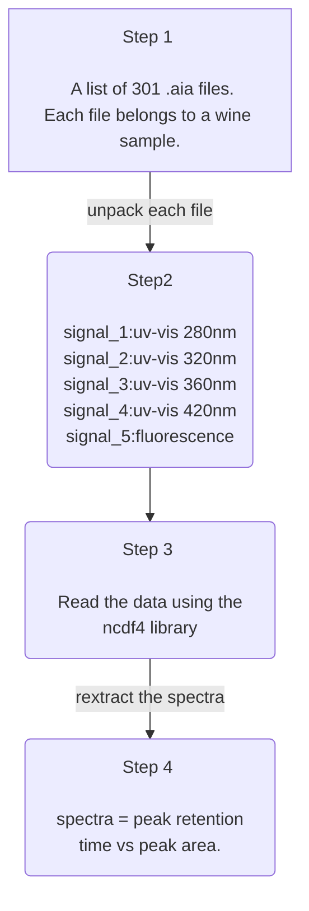

# Introduction
This repository is very specific. It contains a nested dataset extracted from the instrument as .aia files. 
The batch files contained 301 .aia folders each containing five signals (four uv-vis and a fluorescence signal).
These data were generated using scanning gradient in high performance liquid chromatography (HPLC).

## Table of contents

> [Introduction](https://github.com/mpho-mafata/hplc_scanning/tree/main#introduction)
> 
>[Data wrangling](https://github.com/mpho-mafata/hplc_scanning/tree/main#data-wrangling)
> 
> [Inspeting the chromatograms](https://github.com/mpho-mafata/hplc_scanning/tree/main#inspecting-the-chromatograms)
> 
> [Analysing the data](https://github.com/mpho-mafata/hplc_scanning/tree/main#analysing-the-data)
>

# Data wrangling
I started by unnesting the files into workable lists. 
This can always be improved and accomading to the desired analysis pipeline.
This means a total of 1505 spectra processed.

# Inspecting the chromatograms
Then next hurdle is plotting the chromatograms to see if everything is okay inside.
It is always good practice to have a look at the spectra to see if there are any funny things going on.
<table>
 <tr>
<td>
  
  <figcaption> Example overlay spectra for uv_vis 280nm. </figcaption>
</td>

<td>
  
   <figcaption>Example overlay spectra for uv_vis 320nm.</figcaption>
</td>
  </tr>
 
  <tr>
<td>
  
  <figcaption> Example overlay spectra for uv_vis 360nm. </figcaption>
</td>

<td>
  
   <figcaption>Example overlay spectra for uv_vis 420nm.</figcaption>
</td>
 </tr>

  <tr>
<td>
  
  <figcaption> Example overlay fluorescence spectra. </figcaption>
</td>
 </tr>
</table>

# Analysing the data
Next I will try and use multivariate statistics and clustering to decipher the data.
