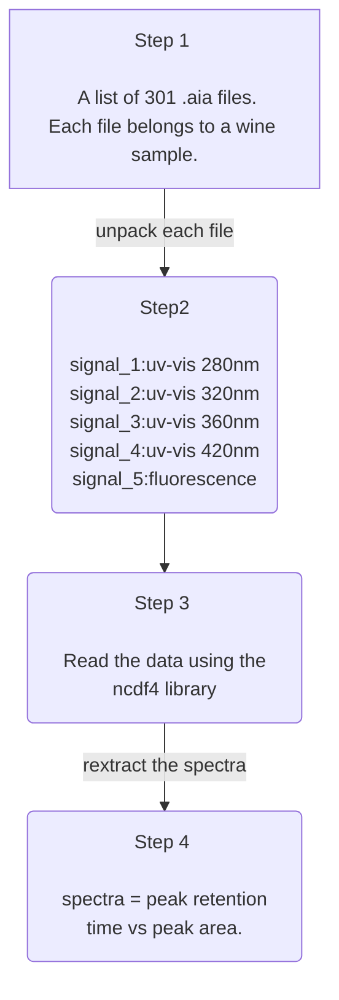
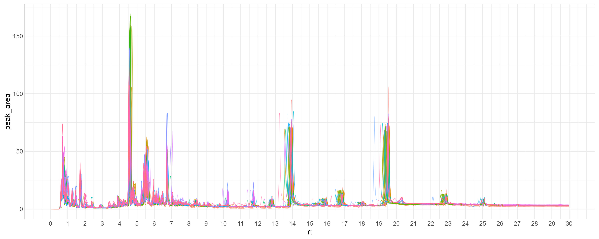
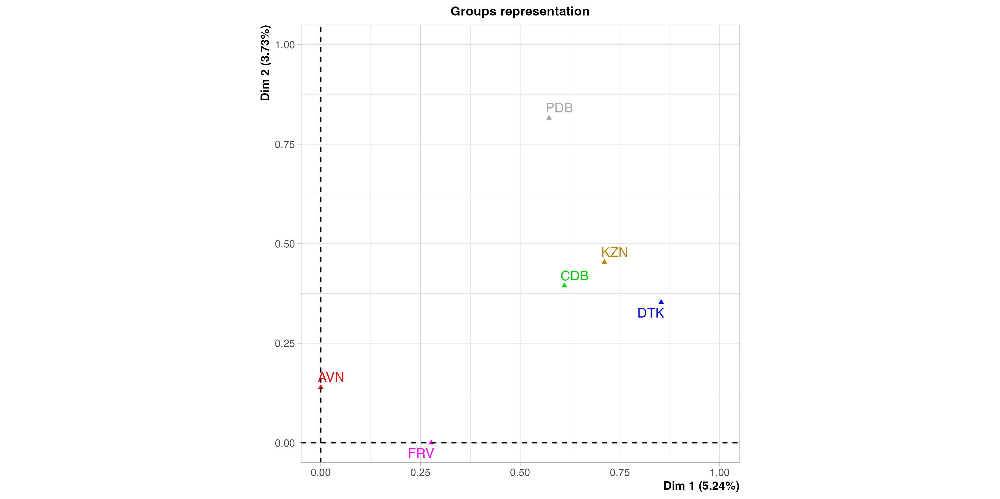

# Introduction
This repository is very specific. It contains a nested dataset extracted from the instrument as .aia files. 
The batch files contained 301 .aia folders each containing five signals (four uv-vis and a fluorescence signal).
These data were generated using scanning gradient in high performance liquid chromatography (HPLC).

## Table of contents

> [Introduction](https://github.com/mpho-mafata/hplc_scanning/tree/main#introduction)
>
>[Data wrangling](https://github.com/mpho-mafata/hplc_scanning/tree/main#data-wrangling)
>
>> [Step 1: Create a data frame with all the .aia file folder names and paths](https://github.com/mpho-mafata/hplc_scanning/tree/main#step-1)
>>
>> [Step 2: Fetch the signal data from each file](https://github.com/mpho-mafata/hplc_scanning/tree/main#step-2)
>>
>> [Step 3: Fetch the data from each signal file](https://github.com/mpho-mafata/hplc_scanning/tree/main#step-3)
>>
>> [Step 4: fetch the spectra for each signal into separate data frames](https://github.com/mpho-mafata/hplc_scanning/tree/main#step-4)
>>
> [Inspeting the chromatograms](https://github.com/mpho-mafata/hplc_scanning/tree/main#inspecting-the-chromatograms)
> 
> [Analysing the data](https://github.com/mpho-mafata/hplc_scanning/tree/main#analysing-the-data)
>

# [Data wrangling](https://github.com/mpho-mafata/hplc_scanning/blob/main/hplc_scanning.R)
I started by unnesting the files into workable lists. 
This can always be improved and accomading to the desired analysis pipeline.
This means a total of 1505 spectra processed.



## Step 1: Create a data frame with all the .aia file folder names and paths
``` {r}
library("tidyverse") # to wrangle data frames
library("glue") 
hplc_wines <-
  data.frame(
    filename = list.files(
      "C:/Users/mafata/Desktop/WORK/Collaborative Work/HPLC scanning/CDF files"
    )
  )
hplc_wines <- hplc_wines  %>%
  mutate(
    filepath = paste0(
      "C:/Users/mafata/Desktop/WORK/Collaborative Work/HPLC scanning/CDF files/",
      filename
    )
  )
```

## Step 2: Fetch the signal data from each file
``` {r}
for (i in 1:length(hplc_wines$filepath)){
  hplc_wines <- hplc_wines  %>%
    mutate(
      samples = str_sub (hplc_wines$filename, end = -8),
      repeats = str_sub (hplc_wines$filename, end = -5),
      uv_280 = paste0(filepath,"/SIGNAL01.cdf"),
      uv_320 = paste0(filepath,"/SIGNAL02.cdf"),
      uv_360 = paste0(filepath,"/SIGNAL03.cdf"),
      uv_420 = paste0(filepath,"/SIGNAL04.cdf"),
      fluo = paste0(filepath,"/SIGNAL05.cdf") # FLD , Ex=280, Em=320
    )
}
```

## Step 3: Fetch the data from each signal file
``` {r}
datasets = c("uv_280","uv_320","uv_360","uv_420","fluo")
for (dataset in datasets){
dataset_list = list()
for (i in 1:length(hplc_wines[[dataset]])){
  dataset_file <- 
    nc_open(
      hplc_wines[[dataset]][i],
      write = FALSE,
      readunlim = FALSE,
      verbose = FALSE,
      auto_GMT = TRUE,
      suppress_dimvals = FALSE,
      return_on_error = FALSE
    )
  dataset_list = append(dataset_list, list(dataset_file))
}
names(dataset_list) = hplc_wines$filename
if (dataset == "uv_280"){uv280_list = dataset_list}
else if (dataset == "uv_320"){uv320_list = dataset_list}
else if (dataset == "uv_360"){uv360_list = dataset_list}
else if (dataset == "uv_420"){uv420_list = dataset_list}
else {fluo_list = dataset_list}
}
```

## Step 4: fetch the spectra for each signal into separate data frames
``` {r}
uv_280_spectra = list()
for (i in 1:length(uv280_list)){
  # Add verbosity to the script
  print(glue(". . . generating sample number {i} uv 280 nm spectra"))
  peak_retention_time <-as.data.frame(ncvar_get(
  uv280_list[[i]],
  uv280_list[[i]]$var$peak_retention_time))
  colnames(peak_retention_time) = "peak_retention_time"
  peak_retention_time <-format(round(peak_retention_time, 0), nsmall = 0)
  peak_area <-as.data.frame(ncvar_get(
  uv280_list[[i]],
  uv280_list[[i]]$var$peak_area))
  colnames(peak_area) = hplc_wines$repeats[i]
  uv_280_spectra <- append(uv_280_spectra,
                              list(name = c(peak_retention_time, peak_area)),
                              after = length(uv_280_spectra))
}
names(uv_280_spectra) = hplc_wines$filename
```

# [Inspecting the chromatograms](https://github.com/mpho-mafata/hplc_scanning/tree/main#data-wrangling)
Then next hurdle is plotting the chromatograms to see if everything is okay inside.
It is always good practice to have a look at the spectra to see if there are any funny things going on.
<table>
 <tr>
<td>
  
  <figcaption> Example overlay spectra for uv_vis 280nm. </figcaption>
</td>

<td>
  
   <figcaption>Example overlay spectra for uv_vis 320nm.</figcaption>
</td>
  </tr>
 
  <tr>
<td>
  
  <figcaption> Example overlay spectra for uv_vis 360nm. </figcaption>
</td>

<td>
  
   <figcaption>Example overlay spectra for uv_vis 420nm.</figcaption>
</td>
 </tr>

  <tr>
<td>
  
  <figcaption> Example overlay fluorescence spectra. </figcaption>
</td>
 </tr>
</table>

# [Analysing the data](https://github.com/mpho-mafata/hplc_scanning/blob/main/hplc_scanning_analysis.R)
From the previous section we can see that something is up. These are not the expected spectral asthetics. In generating this data set, I extracted it as AIA format. Previously, before I started using scripting language, I generated it as a spectrum of values manually and pain-stakingly copied and pasted into an excel sheet. The values were more frequent than this. The AIA extraction may have been due to my specifications when extracting the data in different formats so I need to find out more about how Agilent instrument data extractions are structured and formated since I suspect it may require peak integration. 

## Re-wrangling the data from the spreadsheet
The data was pasted as a tuple in seperate columns so we will extract every couple (RT, Abs) and merge them as a naive way to aligning by the retention time.

```
hplc_wines <-
  readxl::read_excel(path = "/Users/~/HPLC scouting.xlsx",
                     sheet = "280 nm SB") 
uv_280 <- list()
for (i in 1:(ncol(hplc_wines))) {
  first <- as.numeric((2 * i) - 1)
  second <- as.numeric(2 * i)
  sample_i <- hplc_wines[c(first, second)]
  colnames(sample_i)[1] <- c("rt")
  sample_i <- list(sample_i)
  uv_280 <- append(uv_280, sample_i)
}
name_list <-
  row.names(as.data.frame(t(hplc_wines)) %>% filter(row_number() %% 2 == 0))
names(uv_280) <- name_list

# create a merged data frame
merged_uv280_spectra <- full_join(x = as.data.frame(uv_280[[1]]),
                                  y = as.data.frame(uv_280[[2]]),
                                  by = "rt")
for (i in 3:length(uv_280)) {
  merged_uv280_spectra <-
    full_join(
      x = as.data.frame(merged_uv280_spectra),
      y = as.data.frame(uv_280[[i]]),
      by = "rt"
    )
}
merged_uv280_spectra <- merged_uv280_spectra %>%
  pivot_longer(
    !rt,
    names_to = "samples",
    values_to = "peak_area",
    values_drop_na = TRUE
  )
```
If we compare the previous spectra and the above one we see the differences in the spectral frequecies.
<table>
 <tr>
<td>
  
  <figcaption> The previous overlay spectra for uv_vis 280nm. </figcaption>
</td>

<td>
  
   <figcaption>New overlay spectra for uv_vis 280nm.</figcaption>
</td>
  </tr>

 </tr>
</table>


## Multiple Factor Analysis (MFA)
Having inspected the new spectra and feeling confident enough about the spectral properties, we can analyse and compare between sample groups using MFA.

```
mfa_plot <- MFA(
  merged_uv280_spectra[-1],
  group = c(26, 25, 25, 25, 25, 25),
  type = c(rep("s", 6)),
  ncp = 4,
  name.group = c("AVN", "CDB", "DTK", "FRV", "KZN", "PDB"),
  graph = TRUE
)
```

<figcaption>MFA group representation of the spectra for uv_vis 280nm.</figcaption>


