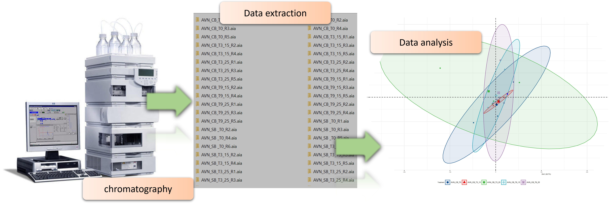
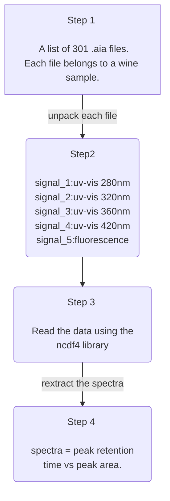
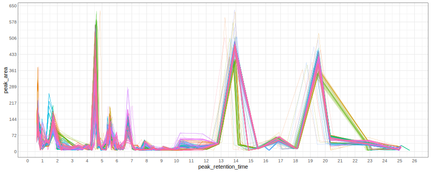
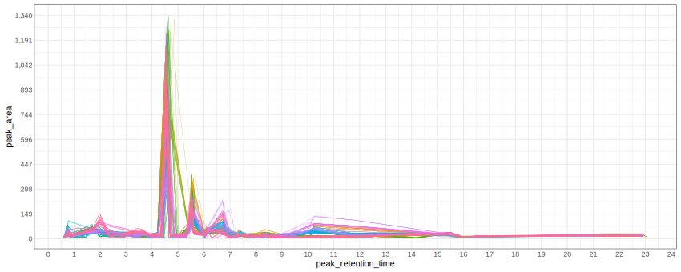
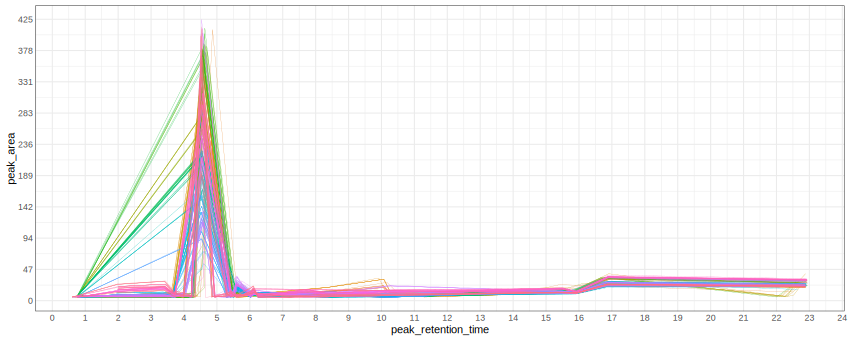
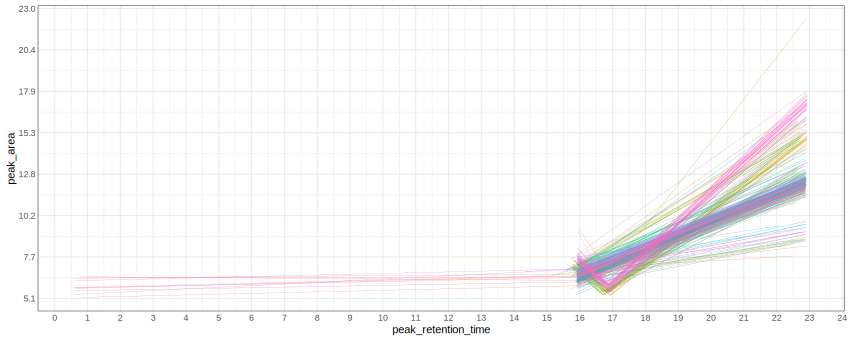
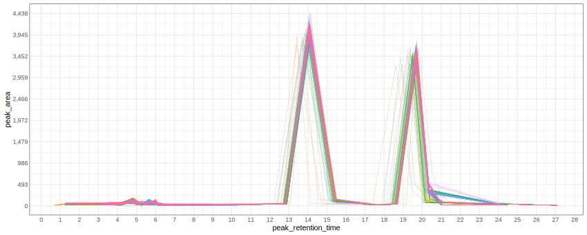

# Introduction
This repository is very specific. It contains a nested dataset extracted from the instrument as .aia files. 
The batch files contained 301 .aia folders each containing five signals (four uv-vis and a fluorescence signal).
These data were generated using scanning gradient in high performance liquid chromatography (HPLC).

## Table of contents

> [Introduction](https://github.com/mpho-mafata/hplc_scanning/tree/main#introduction)
>
>[Data wrangling](https://github.com/mpho-mafata/hplc_scanning/tree/main#data-wrangling)
>
>> [Step 1: Create a data frame with all the .aia file folder names and paths](https://github.com/mpho-mafata/hplc_scanning/tree/main#step-1)
>>
>> [Step 2: Fetch the signal data from each file](https://github.com/mpho-mafata/hplc_scanning/tree/main#step-2)
>>
>> [Step 3: Fetch the data from each signal file](https://github.com/mpho-mafata/hplc_scanning/tree/main#step-3)
>>
>> [Step 4: fetch the spectra for each signal into separate data frames](https://github.com/mpho-mafata/hplc_scanning/tree/main#step-4)
>>
> [Inspeting the chromatograms](https://github.com/mpho-mafata/hplc_scanning/tree/main#inspecting-the-chromatograms)
> 
> [Analysing the data](https://github.com/mpho-mafata/hplc_scanning/tree/main#analysing-the-data)
>

# Data wrangling
I started by unnesting the files into workable lists. 
This can always be improved and accomading to the desired analysis pipeline.
This means a total of 1505 spectra processed.



## Step 1: Create a data frame with all the .aia file folder names and paths
``` {r}
library("tidyverse") # to wrangle data frames
library("glue") 
hplc_wines <-
  data.frame(
    filename = list.files(
      "C:/Users/mafata/Desktop/WORK/Collaborative Work/HPLC scanning/CDF files"
    )
  )
hplc_wines <- hplc_wines  %>%
  mutate(
    filepath = paste0(
      "C:/Users/mafata/Desktop/WORK/Collaborative Work/HPLC scanning/CDF files/",
      filename
    )
  )
```

## Step 2: Fetch the signal data from each file
``` {r}
for (i in 1:length(hplc_wines$filepath)){
  hplc_wines <- hplc_wines  %>%
    mutate(
      samples = str_sub (hplc_wines$filename, end = -8),
      repeats = str_sub (hplc_wines$filename, end = -5),
      uv_280 = paste0(filepath,"/SIGNAL01.cdf"),
      uv_320 = paste0(filepath,"/SIGNAL02.cdf"),
      uv_360 = paste0(filepath,"/SIGNAL03.cdf"),
      uv_420 = paste0(filepath,"/SIGNAL04.cdf"),
      fluo = paste0(filepath,"/SIGNAL05.cdf") # FLD , Ex=280, Em=320
    )
}
```

## Step 3: Fetch the data from each signal file
``` {r}
datasets = c("uv_280","uv_320","uv_360","uv_420","fluo")
for (dataset in datasets){
dataset_list = list()
for (i in 1:length(hplc_wines[[dataset]])){
  dataset_file <- 
    nc_open(
      hplc_wines[[dataset]][i],
      write = FALSE,
      readunlim = FALSE,
      verbose = FALSE,
      auto_GMT = TRUE,
      suppress_dimvals = FALSE,
      return_on_error = FALSE
    )
  dataset_list = append(dataset_list, list(dataset_file))
}
names(dataset_list) = hplc_wines$filename
if (dataset == "uv_280"){uv280_list = dataset_list}
else if (dataset == "uv_320"){uv320_list = dataset_list}
else if (dataset == "uv_360"){uv360_list = dataset_list}
else if (dataset == "uv_420"){uv420_list = dataset_list}
else {fluo_list = dataset_list}
}
```

## Step 4: fetch the spectra for each signal into separate data frames
``` {r}
uv_280_spectra = list()
for (i in 1:length(uv280_list)){
  # Add verbosity to the script
  print(glue(". . . generating sample number {i} uv 280 nm spectra"))
  peak_retention_time <-as.data.frame(ncvar_get(
  uv280_list[[i]],
  uv280_list[[i]]$var$peak_retention_time))
  colnames(peak_retention_time) = "peak_retention_time"
  peak_retention_time <-format(round(peak_retention_time, 0), nsmall = 0)
  peak_area <-as.data.frame(ncvar_get(
  uv280_list[[i]],
  uv280_list[[i]]$var$peak_area))
  colnames(peak_area) = hplc_wines$repeats[i]
  uv_280_spectra <- append(uv_280_spectra,
                              list(name = c(peak_retention_time, peak_area)),
                              after = length(uv_280_spectra))
}
names(uv_280_spectra) = hplc_wines$filename
```

# Inspecting the chromatograms
Then next hurdle is plotting the chromatograms to see if everything is okay inside.
It is always good practice to have a look at the spectra to see if there are any funny things going on.
<table>
 <tr>
<td>
  
  <figcaption> Example overlay spectra for uv_vis 280nm. </figcaption>
</td>

<td>
  
   <figcaption>Example overlay spectra for uv_vis 320nm.</figcaption>
</td>
  </tr>
 
  <tr>
<td>
  
  <figcaption> Example overlay spectra for uv_vis 360nm. </figcaption>
</td>

<td>
  
   <figcaption>Example overlay spectra for uv_vis 420nm.</figcaption>
</td>
 </tr>

  <tr>
<td>
  
  <figcaption> Example overlay fluorescence spectra. </figcaption>
</td>
 </tr>
</table>

From this we can see something is up. This is not the spectrum we expect. In generating this data set, I extracted it as AIA format. Previously, before I started using scripting language, I generated it as a spectrum of values. The values were more frequent than this, I extracted the sprectrum that had a much higher frequency than this. This extraction may have been due to my specifications when extracting the data in different formats so I need to find out more about hoe Agilent instrument data extractions are structured and formated, it took a lot of investigating to begin with. 

# Analysing the data
Next I will try and use multivariate statistics and clustering to decipher the data.
